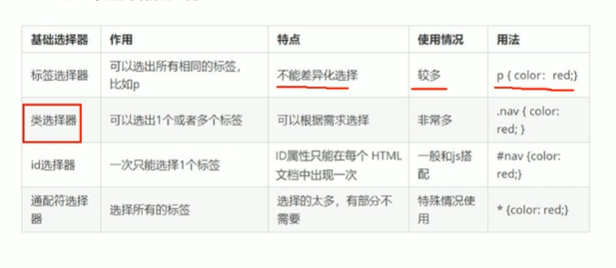
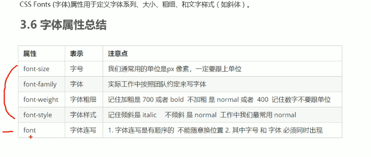

# 一级标题
## 二级标题
### 三级标题
#### 四级标题
##### 五级标题
###### 六级标题

**加粗**
*斜体*
~~加删除线的文字~~
>引用内容
>>引用内容
>>>引用内容


分割线

**************************** 


<a href='https://www.baidu.com' target='_blank'>baidu</a>

+ 无序列表（+ - *）
  
1.有序列表（数字加 .）


姓名|技能|排行
--|:--:|--:
刘备|哭|大哥


`var u = 9;`

```js
var a =10;
```

```flow
st=>start: 开始
op=>operation: My Operation
cond=>condition: Yes or No?
e=>end
st->op->cond
cond(yes)->e
cond(no)->op
&```


- 安装文档
  - 系统检测






